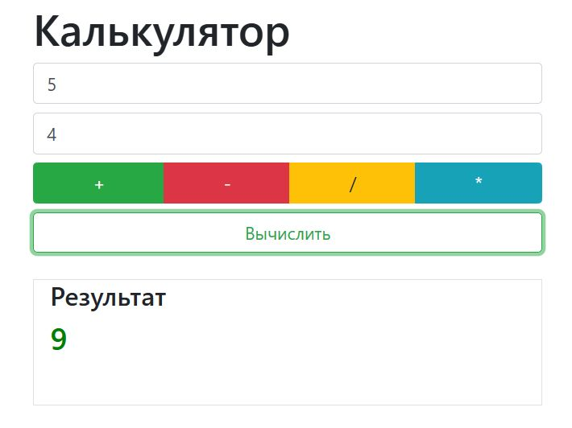

## Калькулятор

Функционал: 

- Ввод чисел

- Обработка операций "+", "-", "/", "*"

- Получение результата по Enter и "click"

Стили:

- Изменение цвета кнопки "Вычислить" в соответствии с нажатой операцией.

- Изменение цвета полученног результата (красный < 0, зеленый > 0)

